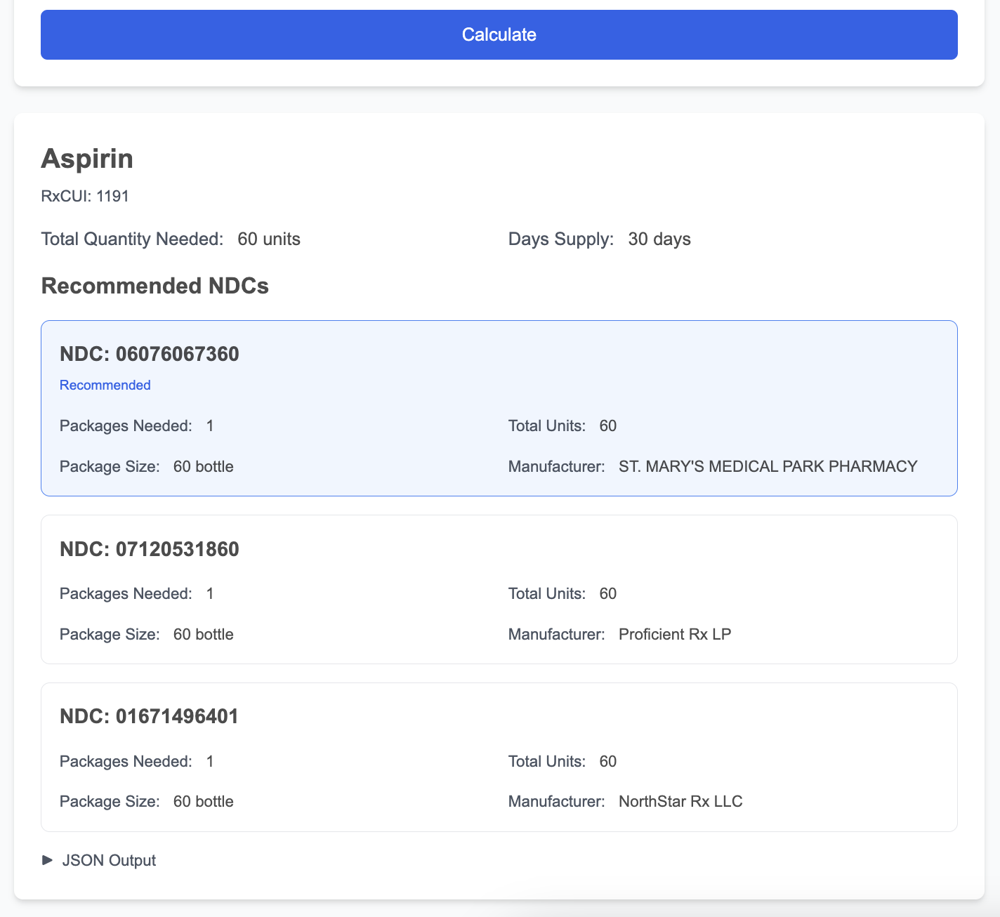
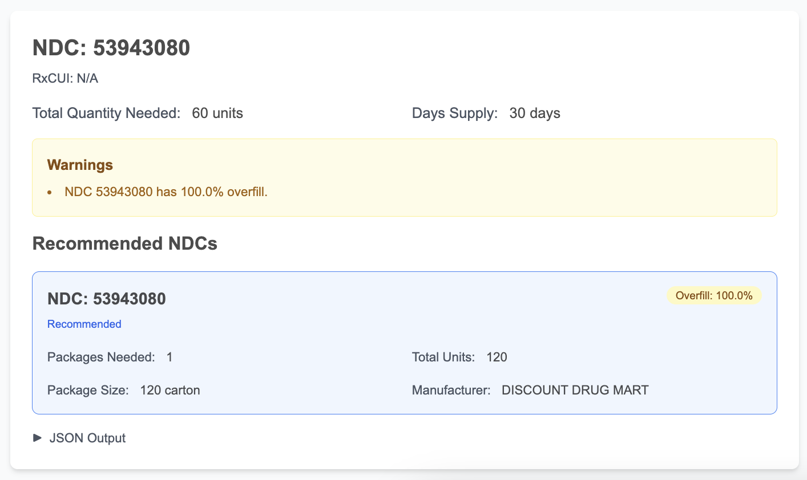
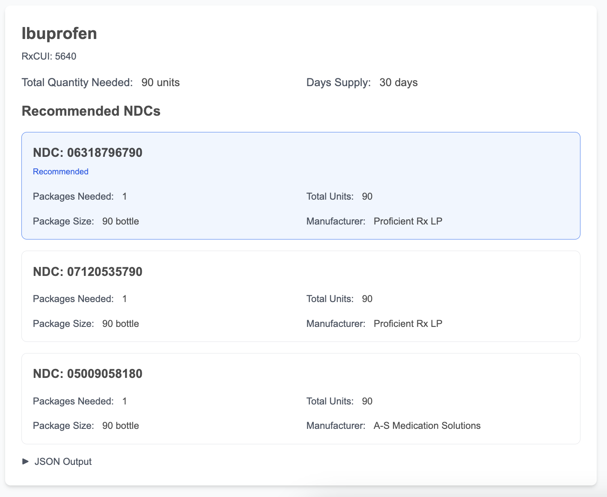

# Manual Testing Scenarios

## Test 1: Basic Forward Calculation
**Input:**
- Drug: `aspirin`
- SIG: `1 tablet twice daily`
- Days: `30`

**Expected:** Total quantity 60 tablets, NDC recommendations displayed, no errors

**Result:** ✅ PASSED

---

## Test 2: Direct NDC Input
**Input:**
- Drug/NDC: `53943-080` (product NDC format - verified to work with FDA API)
- SIG: `2 tablets daily`
- Days: `30`

**Expected:** Bypasses RxNorm, shows NDC results for the specified NDC

**Result:** ✅ PASSED

**Note:** The FDA API requires product_ndc format (8-9 digits with dashes) for direct lookup. Package-level NDCs (11 digits) must be looked up via their parent product_ndc. The result shows 100% overfill warning (60 units needed, 120 unit package available).

---

## Test 3: Reverse Calculation
**Input:**
- Drug: `ibuprofen`
- SIG: `1 tablet 3 times daily`
- Days: (leave empty)
- Quantity: `90`

**Expected:** Calculated days supply: 30 days

**Result:** ✅ PASSED

---

## Test 4: Error Handling - Invalid Drug
**Input:**
- Drug: `xyzabc123nonexistent`
- SIG: `1 tablet daily`
- Days: `30`

**Expected:** User-friendly error message

---

## Test 5: Error Handling - Invalid Input
**Input:**
- Empty drug name
- Empty SIG
- Days: `0`

**Expected:** Validation errors displayed, form prevents submission

---

## Test 6: Warning Display
**Input:** Any valid calculation that results in inactive NDCs or >10% overfill

**Guidance for constructing test inputs:**
- **Overfill warning (>10%):** Use a small quantity needed with a drug that has large package sizes. For example:
  - Drug: `aspirin`
  - SIG: `1 tablet daily`
  - Days: `7` (needs 7 tablets)
  - This will likely trigger overfill warnings if only large packages (e.g., 60+ tablets) are available
  
- **Inactive NDC warning:** The system automatically shows warnings for any recommended NDCs that are marked as inactive in the FDA database. This depends on which NDCs are returned for a given drug.

**Expected:** Warning badges displayed (yellow for overfill, red for inactive) on affected NDC recommendations

---

## Test 7: JSON Output
**Input:** Any valid calculation

**Expected:** "Show JSON" button toggles formatted JSON output

